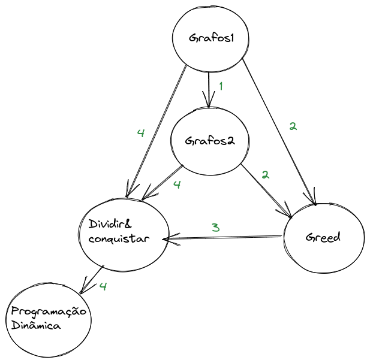
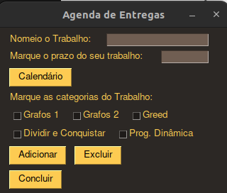
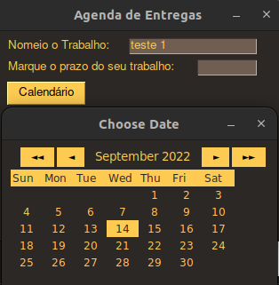
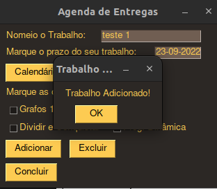
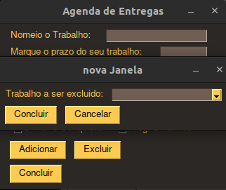

# Final_Agenda2.0

**Conteúdo da Disciplina**: Final<br>

## Alunos
|Matrícula | Aluno 
| -- | -- | 
| 18/0018159  |  Guilherme Veríssimo Cerveira Braz | 
| 18/0108344  |  Rafael Berto Pereira | 

## Sobre 
O Objetivo deste trabalho é melhorar a implementação da agenda de tarefas que foi implementada no módulo de algorítimo ambicioso.

Além do algoritimo de Interval Scheduling na agenda, iremos utilizar uma inferencia de grafos para calcular a estimativa de duração de uma tarefa para depois organizar na agenda.

O grafo foi implementado utilizando a biblioteca networkx ([documentação networX](https://networkx.org/documentation/stable/index.html)), e ele foi estruturado pensando na complexidade e relação entre as categorias. Assim foi optado por utilizar um grafo direcionado, onde as arestas são as relações entre as categorias, e os nós são as categorias. E as arestas possuem pesos que representam a complexidade de uma tarefa caso va adicionando mais categorias ao seu trabalho.
Por final foi usado algoritmo DFS de busca em grafos para encontrar todos os caminhos de um no ate o outro e dessa combinação total foram filtrados apenas aqueles que contem todos os nos das categorias escolhidas. Desses caminhos foi calculado o peso total de cada um e escolhido o caminho com menor peso.

Segue a imagem do grafo:



## Screenshots

### Pagina principal
A primeira tela da aplicação. Onde o usuário irá indicar o prazo, marcar as categorias do trabalho, adicionar e/ou excluir trabalhos



### Calendário
Marque o prazo do seu projeto usando o calendário



### Projeto adicionado
Mensagem após a adição de um novo projeto



### Exclusão de um projeto
Apos clicar no botão de excluir abre-se esse menu


## Video
Em Breve

## Instalação 
```sh
pip install PySimpleGUI 
```

```sh 
pip install --upgrade google-api-python-client google-auth-httplib2 google-auth-oauthlib 
```

**Linguagem**: Python3 <br>
**Bibliotecas**: 
- NetworkX
- PySimpleGUI; 
- google-api-python-client;
- google-auth-httplib2;
- google-auth-oauthlib<br>

**Pre-Requisitos**: Python 3.10.4 <br>
## Uso 
* python main.py
